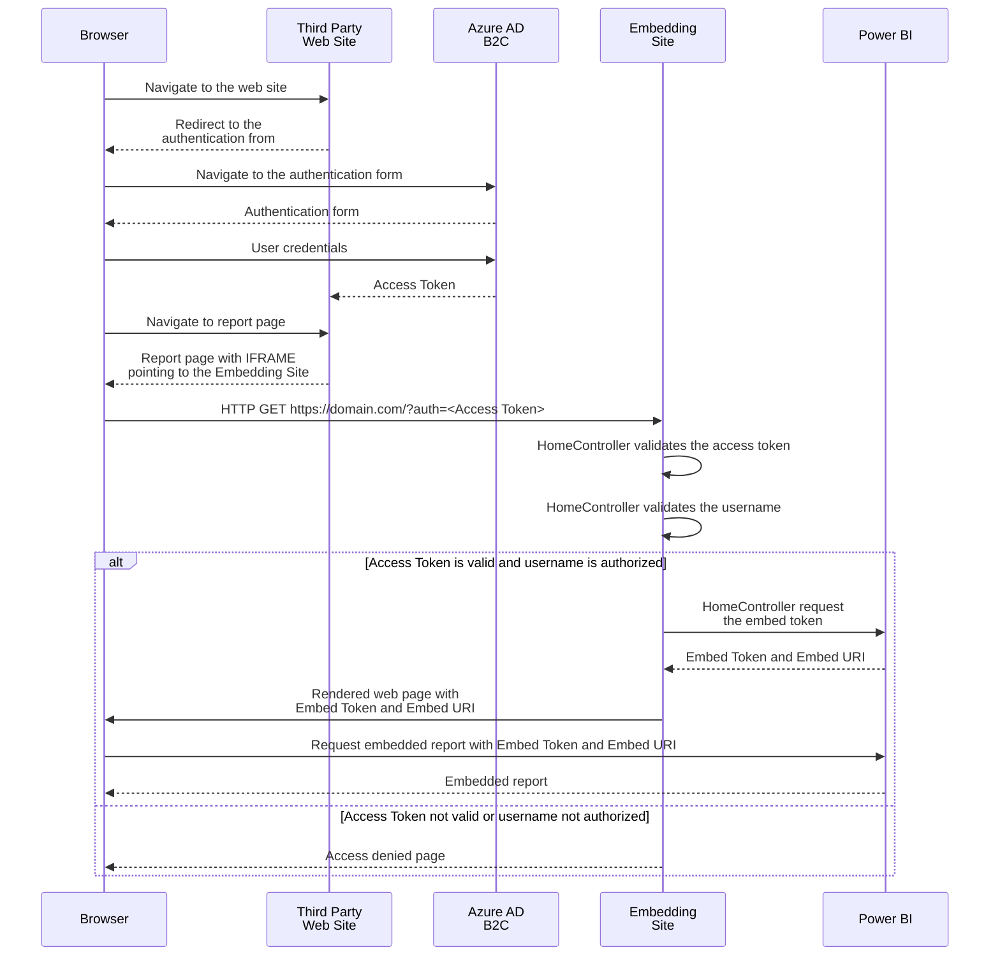

```mermaid
sequenceDiagram
    participant Browser
    participant Site as Third Party<br>Web Site
    participant AAD as Azure AD<br>B2C
    participant Embedder as Embedding<br>Site
    participant PowerBI as Power BI
    
    Browser->>Site: Navigate to the web site
    Site-->>Browser: Redirect to the<br>authentication from
    Browser->>AAD: Navigate to the authentication form
    AAD-->>Browser: Authentication form
    Browser->>AAD: User credentials
    AAD-->>Site: Access Token
    Browser->>Site: Navigate to report page
    Site-->>Browser: Report page with IFRAME<br>pointing to the Embedding Site
    Browser->>Embedder: HTTP GET https://domain.com/?auth=<Access Token>
    Embedder->>Embedder: HomeController validates the access token
    Embedder->>Embedder: HomeController validates the username
    alt Access Token is valid and username is authorized
        Embedder->>PowerBI: HomeController request<br>the embed token
        PowerBI-->>Embedder: Embed Token and Embed URI
        Embedder->>Browser: Rendered web page with<br>Embed Token and Embed URI
        Browser->>PowerBI: Request embedded report with Embed Token and Embed URI
        PowerBI-->>Browser: Embedded report
    else Access Token not valid or username not authorized
        Embedder-->>Browser: Access denied page
    end
```